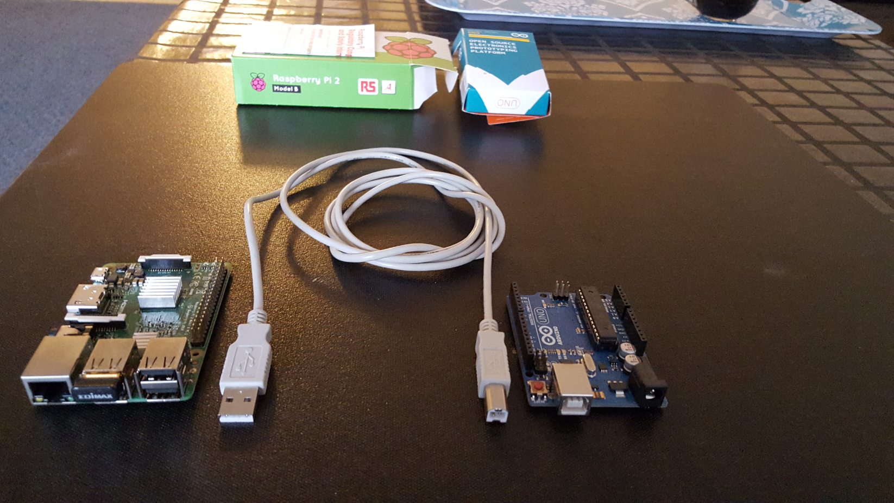
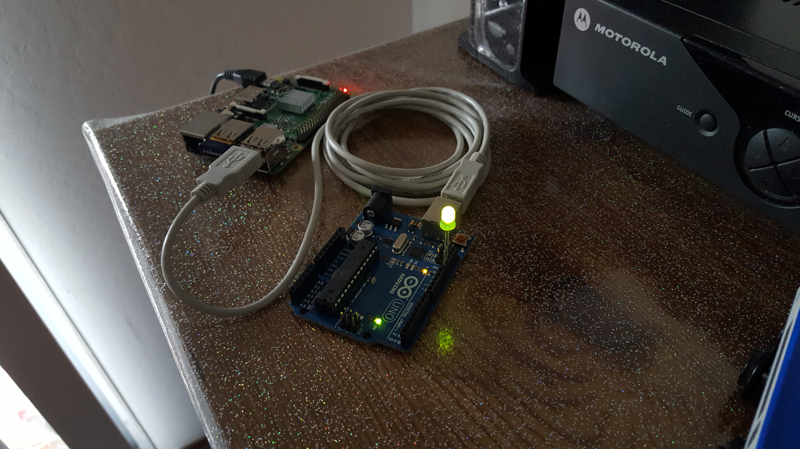

<h1 style="color:#1589F0;">Demo Project</h1>
In this project you will use the Gui Maker mobile app to 
control a remote webcam

Find the guide to the Gui Maker app here: https://guimaker.app

&nbsp;&nbsp;&nbsp;

&nbsp;&nbsp;&nbsp;&nbsp;&nbsp;&nbsp;


## Project name: Switch on/off a led attached to an Arduino Uno
Read the project details first here: https://guimaker.pro/demoprojects

## Project setup
First download the project to your pc, next
1. Copy your database config to the firebase-config.json file
2. Edit the key-filename.json
3. Edit the environment variables in dash.env
4. Copy the project folder to your Raspbery Pi
5. SSH to your Raspberry Pi and run the setup.sh script to complete the setup

## 1 Copy the Firbase database config
- Log in to the Firebase console
- Go to Project Settings, then scroll down
 Copy the key-value pairs along with the curly brackets to the the firebase-config.json

Note: setup.sh will wrap the keys with double quotes to make the firebase-config.json a valid json file

## 2 Edit dash.env 
Complete or edit the values for:
- EMAIL=
- PASSWORD=
- DASHBOARD_NAME=

- USB_PORT=ttyACM0
- LED_SWITCH_LABEL=Led
- FIREBASE_CONFIG=firebase-config.json

The Arduino should attached to the USB port ttyACM0 of the Raspberry Pi. 
You can run the command 'dmesg | grep' on the Raspberry Pi to be sure in case if you 
have more than on device attached to the Raspberry Pi

## 3 Copy the project folder to the raspberry Pi
Let's say:
- Your project name is "led"
- The destination folder on the Pi is /home/pi
- The Pi ip address is 10.0.0.30

Run:  ``` scp -r led pi@10.0.0.30:/home/pi ```

## 4 Run the setup.sh script to complete the setup
SSH to the raspberry then cd to your project folder and run:
bash setup.sh

The script will:
- Set the project name to the project folder name
- Set the project description
- Install the dependencies
- Add executable permissions to dash.js
- Add the project folder path to dash.env
- Rename the following files to:
  - dash.js        > led.js
  - dash.env       > led.env
  - dash.service   > led.service

- Replace 'dash' with the project name (led) in packge.json, package-lock.json
  - "name": "dash" 
  - "main": "dash.js"

- Wrap the firebase-config.json keys with double quotes 

- Configure the led.service file by updating the following:
  - project description
  - path2dah.js
  - dash-identifier
  - user-name
  - path2dash.env

- Move the led.service file to /etc/systemd/sysem
- Enable the led service to start at boot time
- Start the led service
- Check the led service status
 
## Troubleshoot the setup
Check the path and filenames are correctly spelled in:
  - led.env
  - led.service

  Keep in mind that Dashboard names created in the mobile app are case sensitive
